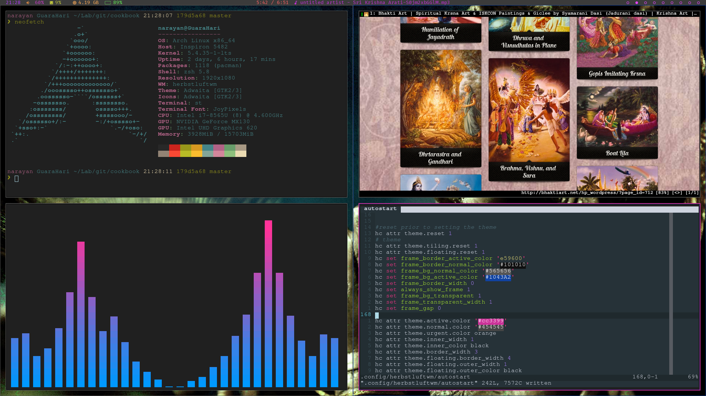

# Herbstluftwm
## Preview


```sh
pacstrap /mnt bash-completion nvim iwd xorg base base-devel linux linux-firmware lvm2 dhcpcd efibootmgr intel-ucode xf86-video-intel vi dhclient
```

### hebstlutwm:
```sh
cp /etc/X11/xinit/xinitrc ~/.xinitrc
e ~/.xinitrc
exec herbstluftwm

polybar
st
```


## Installed apps
* git
* archlinux-keyring
* rust
* go
* nodejs
* npm 
* pip
* brightnessctl (control screenbrightness from cli)
* slack
* weechat (terminal irc client) 
	- https://github.com/wee-slack/wee-slack
* neovim (terminal text/code editor)
	- https://github.com/junegunn/vim-plug
  - once nvim has been installed and configured open nvim
  - and run `:checkhealth`
  - https://github.com/neoclide/coc.nvim/wiki/Install-coc.nvim
      - `:CocInstall coc-css coc-tsserver coc-go coc-html coc-json coc-yaml coc-python coc-sql coc-fzf-preview coc-python`
* ZSH plugins
	- https://github.com/shibumi/hikari-zsh
	- https://github.com/zdharma/fast-syntax-highlighting
* lf (terminal file manager)
	- aur/python-pdftotext
	- chafa
	- odttotext
	- atool
	- w3m
	- mpv
	- mediainfo
* qutebrowser (vim based web browser)
* firefox (web browser)
* brave[aur] (web browser)
* slock (Screen locker)
* st (default terminal)
* termite (terminal)
* skim - (fuzzy finder written in rust)
* bat - (like cat but with syntax highlighting)
* dmenu (minimal menu to search and open apps)
* rg - (blazing fast grep alternative, written in rust)
* Fonts
  - community/ttf-font-awesome
  - aur/ttf-font-awesome-4
  - community/awesome-terminal-fonts
  - ttf-material-design-icons-git
  - noto-fonts noto-fonts-cjk noto-fonts-emoji noto-fonts-extra
  - ttf-joypixels
  - aur/nerd-fonts-complete (I think this contains everything)
    - ```sh
        $ cd ~/Downloads (you need ~4GB of space to build)
        $ yay --getpkgbuild nerd-fonts-complete
        $ cd nerd-fonts-complete
        $ wget -O nerd-fonts-2.1.0.tar.gz https://github.com/ryanoasis/nerd-fonts/archive/v2.1.0.tar.gz
        $ makepkg -sci BUILDDIR=.
      ```
  - aur/sanskrit-fonts
  - aur - ttf-ancient-fonts
  - aur - ttf-fira-code
  - aur - ttf-inconsolata
  - aur - ttf-google-fonts-git ?
  - adobe-source-han-sans-otc-fonts ?
  - adobe-source-han-serif-otc-fonts ?
  - aur/ttf-tw ?
  - search for installed fonts with: `fc-list | rg -i devanagari`
* gotop
* htop
* zathura - (Zathura is a highly customizable and functional document viewer)
	- zathura-pdf-mupdf-0.3.5-2
	- zathura
* audio
	- pulseaudio 
	- pulseaudio-alsa
	- alsa-utils ( provides alsamixer [tui volumecontrol] and alsamixer)
	- alsa-plugins
	- pulsemixer (tui volumecontrol center)
		https://github.com/GeorgeFilipkin/pulsemixer 
  - pavucontrol (graphical volume control center)
* feh (set bacground)
* arandr
* rsync
* zip
* unzip
* lsof
* jq  (json text viewer)
* youtube-dl
* youtube-viewer
* mpv slack(cil media player)
* acpi (client for battery, power, and thermal readings)
* imagemagick (cli image manipulation)
* sysbench (bench markin tool)
* sxiv (image/gif viewer)
* xclip (copy util)
* calibre (ebook reader and converter)
* libreoffice
   - contains `ebook-convert` cli tools
* npm i tldr -g (simplified man pages)
* pip install mdv --user (Terminal Markdown viewer)
* pip install grip --user (Markdown viewer)
* diff-so-fancy
  - Add config once installed https://github.com/so-fancy/diff-so-fancy
* mpd
* ncmpcpp
  - https://computingforgeeks.com/how-to-configure-mpd-and-ncmpcpp-on-linux/
    (configure mpd and ncmpcpp)
* redshift (eye protection)
  - https://www.maketecheasier.com/protect-eyes-redshift-linux/
* simple-mtpfs (mount andriod device)
* nvidia-dkms nvidia-utils lib32-nvidia-utils nvidia-settings vulkan-icd-loader lib32-vulkan-icd-loader (Nvidia graphics drivers)
* optimus-manager [aur](switch between onboard graphics and gpu)
* lightdm (display manager)
* lightdm-slick-greeter [aur](lightdm greeter)
* i7z (CPU reporting tool)
* cpupower (CPU frequency scaling)
* thermald [aur] (prevent the overheating of platforms)(thermald.service, which should be started and enabled)
* acpid (delivering ACPI events)
* powertop (monitor processes and show which of them are utilizing the CPU )
  - Automatically tune power saving settings
    https://wiki.archlinux.org/index.php/Powertop#Usage

    1. Chech the discharge rate and press `tab` and look at the `Tunables`. 
    ```sh
    sudo powertop
    ```
    
    Use the `--auto-tune` feature from powertop which sets all tunable options to their GOOD setting. This can be combined with systemd service to have the tunables set on boot. 
    
    2. sudoedit `/etc/systemd/system/powertop.service`
    ```sh
    [Unit]
    Description=Powertop tunings

    [Service]
    Type=exec
    ExecStart=/usr/bin/powertop --auto-tune
    RemainAfterExit=true

    [Install]
    WantedBy=multi-user.target
    ```

    3. Start and enable powertop
    ```sh
     sudo systemctl start powertop.service
     sudo systemctl enable powertop.service
    ```
* i8kutils[aur] (manual fan control)
* crystal (programming language)
* shards (crystal package manager)
* gopass (cli password manager)
* adb (andriod flashing tool)
* zenity (vim colour picker dependecies)
* gucharmap (gnome character map, view fonts and icons)
* cava (Console-based Audio Visualize)
* fasd (quick access to files and directories for POSIX shells)
* lsd (next gen ls)
* thunar (file manager)
* lxappearance (set gtk and icon theme)
* nmap
* wine 
* sudo pip install jedi (python autocompletion)

    - `sudo pacman -S wine-staging giflib lib32-giflib libpng lib32-libpng libldap lib32-libldap gnutls lib32-gnutls mpg123 lib32-mpg123 openal lib32-openal v4l-utils lib32-v4l-utils libpulse lib32-libpulse libgpg-error lib32-libgpg-error alsa-plugins lib32-alsa-plugins alsa-lib lib32-alsa-lib libjpeg-turbo lib32-libjpeg-turbo sqlite lib32-sqlite libxcomposite lib32-libxcomposite libxinerama lib32-libgcrypt libgcrypt lib32-libxinerama ncurses lib32-ncurses opencl-icd-loader lib32-opencl-icd-loader libxslt lib32-libxslt libva lib32-libva gtk3 lib32-gtk3 gst-plugins-base-libs lib32-gst-plugins-base-libs vulkan-icd-loader lib32-vulkan-icd-loader`
* bind-tools (dig)
* vscodium-bin [aur] (Free version of Visual Studio Code)
* fzf (Fuzzy file finder, used in vim)
* libxft-bgra[aur] (Helps ST render emojis, ST crashes without this)
* keybase-bin[aur] (encrypted chat and git app) 
* kubectx (Switch backand forth bewteen kubernetes clusters)
* ksd[aur] (decode k8s secrets)
* stern[aur] (View multiple k8s logs)
* popeye[aur] (k8s resource auditer)

# Extra
## Set qutebrowser as default
`xdg-settings set default-web-browser org.qutebrowser.qutebrowser.desktop`
`xdg-settings set default-web-browser brave-bin.desktop`


## Switch off bluetooth from starting automatically
`systemctl status bluetooth.target`

## NVIM
```
once nvim has been installed and configured open nvim
and run :checkhealth
https://github.com/neoclide/coc.nvim/wiki/Install-coc.nvim
```

## Arch linux switching kernals with systemd boot
- https://bbs.archlinux.org/viewtopic.php?id=235116
 
## Arch linux dell inspiron nvme - install guide
- https://gist.github.com/binaerbaum/535884a7f5b8a8697557

